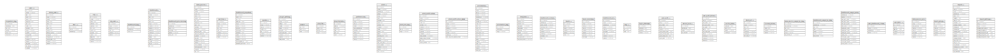

# grafana.db

## Tables

| Name | Columns | Comment | Type |
| ---- | ------- | ------- | ---- |
| [migration_log](migration_log.md) | 6 |  | table |
| [user](user.md) | 18 |  | table |
| [temp_user](temp_user.md) | 14 |  | table |
| [star](star.md) | 3 |  | table |
| [org](org.md) | 12 |  | table |
| [org_user](org_user.md) | 6 |  | table |
| [dashboard_tag](dashboard_tag.md) | 3 |  | table |
| [dashboard](dashboard.md) | 16 |  | table |
| [dashboard_provisioning](dashboard_provisioning.md) | 6 |  | table |
| [data_source](data_source.md) | 21 |  | table |
| [api_key](api_key.md) | 8 |  | table |
| [dashboard_snapshot](dashboard_snapshot.md) | 14 |  | table |
| [quota](quota.md) | 7 |  | table |
| [plugin_setting](plugin_setting.md) | 10 |  | table |
| [session](session.md) | 3 |  | table |
| [playlist](playlist.md) | 4 |  | table |
| [playlist_item](playlist_item.md) | 6 |  | table |
| [preferences](preferences.md) | 10 |  | table |
| [alert](alert.md) | 21 |  | table |
| [alert_rule_tag](alert_rule_tag.md) | 3 |  | table |
| [alert_notification](alert_notification.md) | 13 |  | table |
| [alert_notification_state](alert_notification_state.md) | 8 |  | table |
| [annotation](annotation.md) | 20 |  | table |
| [annotation_tag](annotation_tag.md) | 3 |  | table |
| [test_data](test_data.md) | 10 |  | table |
| [dashboard_version](dashboard_version.md) | 9 |  | table |
| [team](team.md) | 6 |  | table |
| [team_member](team_member.md) | 8 |  | table |
| [dashboard_acl](dashboard_acl.md) | 9 |  | table |
| [tag](tag.md) | 3 |  | table |
| [login_attempt](login_attempt.md) | 4 |  | table |
| [user_auth](user_auth.md) | 9 |  | table |
| [server_lock](server_lock.md) | 4 |  | table |
| [user_auth_token](user_auth_token.md) | 11 |  | table |
| [cache_data](cache_data.md) | 4 |  | table |
| [short_url](short_url.md) | 7 |  | table |
| [license_token](license_token.md) | 4 |  | table |
| [data_source_usage_by_day](data_source_usage_by_day.md) | 6 |  | table |
| [dashboard_usage_by_day](dashboard_usage_by_day.md) | 7 |  | table |
| [dashboard_usage_sums](dashboard_usage_sums.md) | 14 |  | table |
| [user_dashboard_views](user_dashboard_views.md) | 4 |  | table |
| [user_stats](user_stats.md) | 5 |  | table |
| [data_source_acl](data_source_acl.md) | 8 |  | table |
| [team_group](team_group.md) | 6 |  | table |
| [report](report.md) | 21 |  | table |
| [report_settings](report_settings.md) | 8 |  | table |

## Relations

---

> Generated by [tbls](https://github.com/k1LoW/tbls)
