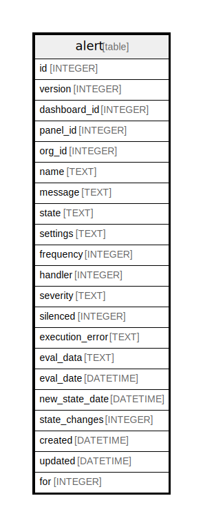

# alert

## Description

<details>
<summary><strong>Table Definition</strong></summary>

```sql
CREATE TABLE `alert` (
`id` INTEGER PRIMARY KEY AUTOINCREMENT NOT NULL
, `version` INTEGER NOT NULL
, `dashboard_id` INTEGER NOT NULL
, `panel_id` INTEGER NOT NULL
, `org_id` INTEGER NOT NULL
, `name` TEXT NOT NULL
, `message` TEXT NOT NULL
, `state` TEXT NOT NULL
, `settings` TEXT NOT NULL
, `frequency` INTEGER NOT NULL
, `handler` INTEGER NOT NULL
, `severity` TEXT NOT NULL
, `silenced` INTEGER NOT NULL
, `execution_error` TEXT NOT NULL
, `eval_data` TEXT NULL
, `eval_date` DATETIME NULL
, `new_state_date` DATETIME NOT NULL
, `state_changes` INTEGER NOT NULL
, `created` DATETIME NOT NULL
, `updated` DATETIME NOT NULL
, `for` INTEGER NULL)
```

</details>

## Columns

| Name | Type | Default | Nullable | Children | Parents | Comment |
| ---- | ---- | ------- | -------- | -------- | ------- | ------- |
| id | INTEGER |  | false |  |  |  |
| version | INTEGER |  | false |  |  |  |
| dashboard_id | INTEGER |  | false |  |  |  |
| panel_id | INTEGER |  | false |  |  |  |
| org_id | INTEGER |  | false |  |  |  |
| name | TEXT |  | false |  |  |  |
| message | TEXT |  | false |  |  |  |
| state | TEXT |  | false |  |  |  |
| settings | TEXT |  | false |  |  |  |
| frequency | INTEGER |  | false |  |  |  |
| handler | INTEGER |  | false |  |  |  |
| severity | TEXT |  | false |  |  |  |
| silenced | INTEGER |  | false |  |  |  |
| execution_error | TEXT |  | false |  |  |  |
| eval_data | TEXT |  | true |  |  |  |
| eval_date | DATETIME |  | true |  |  |  |
| new_state_date | DATETIME |  | false |  |  |  |
| state_changes | INTEGER |  | false |  |  |  |
| created | DATETIME |  | false |  |  |  |
| updated | DATETIME |  | false |  |  |  |
| for | INTEGER |  | true |  |  |  |

## Constraints

| Name | Type | Definition |
| ---- | ---- | ---------- |
| id | PRIMARY KEY | PRIMARY KEY (id) |

## Indexes

| Name | Definition |
| ---- | ---------- |
| IDX_alert_dashboard_id | CREATE INDEX `IDX_alert_dashboard_id` ON `alert` (`dashboard_id`) |
| IDX_alert_state | CREATE INDEX `IDX_alert_state` ON `alert` (`state`) |
| IDX_alert_org_id_id | CREATE INDEX `IDX_alert_org_id_id` ON `alert` (`org_id`,`id`) |

## Relations



---

> Generated by [tbls](https://github.com/k1LoW/tbls)
