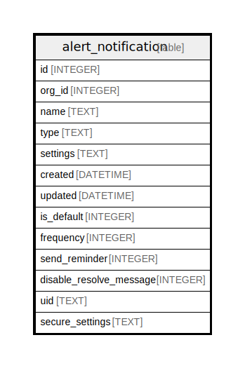

# alert_notification

## Description

<details>
<summary><strong>Table Definition</strong></summary>

```sql
CREATE TABLE `alert_notification` (
`id` INTEGER PRIMARY KEY AUTOINCREMENT NOT NULL
, `org_id` INTEGER NOT NULL
, `name` TEXT NOT NULL
, `type` TEXT NOT NULL
, `settings` TEXT NOT NULL
, `created` DATETIME NOT NULL
, `updated` DATETIME NOT NULL
, `is_default` INTEGER NOT NULL DEFAULT 0, `frequency` INTEGER NULL, `send_reminder` INTEGER NULL DEFAULT 0, `disable_resolve_message` INTEGER NOT NULL DEFAULT 0, `uid` TEXT NULL, `secure_settings` TEXT NULL)
```

</details>

## Columns

| Name | Type | Default | Nullable | Children | Parents | Comment |
| ---- | ---- | ------- | -------- | -------- | ------- | ------- |
| id | INTEGER |  | false |  |  |  |
| org_id | INTEGER |  | false |  |  |  |
| name | TEXT |  | false |  |  |  |
| type | TEXT |  | false |  |  |  |
| settings | TEXT |  | false |  |  |  |
| created | DATETIME |  | false |  |  |  |
| updated | DATETIME |  | false |  |  |  |
| is_default | INTEGER | 0 | false |  |  |  |
| frequency | INTEGER |  | true |  |  |  |
| send_reminder | INTEGER | 0 | true |  |  |  |
| disable_resolve_message | INTEGER | 0 | false |  |  |  |
| uid | TEXT |  | true |  |  |  |
| secure_settings | TEXT |  | true |  |  |  |

## Constraints

| Name | Type | Definition |
| ---- | ---- | ---------- |
| id | PRIMARY KEY | PRIMARY KEY (id) |

## Indexes

| Name | Definition |
| ---- | ---------- |
| UQE_alert_notification_org_id_uid | CREATE UNIQUE INDEX `UQE_alert_notification_org_id_uid` ON `alert_notification` (`org_id`,`uid`) |

## Relations



---

> Generated by [tbls](https://github.com/k1LoW/tbls)
