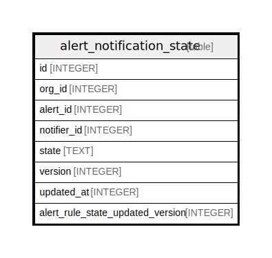

# alert_notification_state

## Description

<details>
<summary><strong>Table Definition</strong></summary>

```sql
CREATE TABLE `alert_notification_state` (
`id` INTEGER PRIMARY KEY AUTOINCREMENT NOT NULL
, `org_id` INTEGER NOT NULL
, `alert_id` INTEGER NOT NULL
, `notifier_id` INTEGER NOT NULL
, `state` TEXT NOT NULL
, `version` INTEGER NOT NULL
, `updated_at` INTEGER NOT NULL
, `alert_rule_state_updated_version` INTEGER NOT NULL
)
```

</details>

## Columns

| Name | Type | Default | Nullable | Children | Parents | Comment |
| ---- | ---- | ------- | -------- | -------- | ------- | ------- |
| id | INTEGER |  | false |  |  |  |
| org_id | INTEGER |  | false |  |  |  |
| alert_id | INTEGER |  | false |  |  |  |
| notifier_id | INTEGER |  | false |  |  |  |
| state | TEXT |  | false |  |  |  |
| version | INTEGER |  | false |  |  |  |
| updated_at | INTEGER |  | false |  |  |  |
| alert_rule_state_updated_version | INTEGER |  | false |  |  |  |

## Constraints

| Name | Type | Definition |
| ---- | ---- | ---------- |
| id | PRIMARY KEY | PRIMARY KEY (id) |

## Indexes

| Name | Definition |
| ---- | ---------- |
| IDX_alert_notification_state_alert_id | CREATE INDEX `IDX_alert_notification_state_alert_id` ON `alert_notification_state` (`alert_id`) |
| UQE_alert_notification_state_org_id_alert_id_notifier_id | CREATE UNIQUE INDEX `UQE_alert_notification_state_org_id_alert_id_notifier_id` ON `alert_notification_state` (`org_id`,`alert_id`,`notifier_id`) |

## Relations



---

> Generated by [tbls](https://github.com/k1LoW/tbls)
