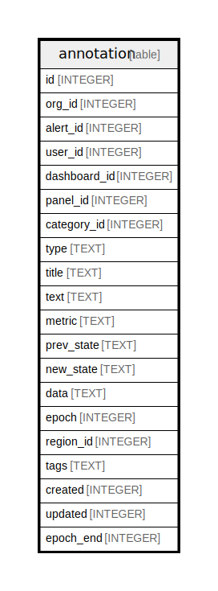

# annotation

## Description

<details>
<summary><strong>Table Definition</strong></summary>

```sql
CREATE TABLE `annotation` (
`id` INTEGER PRIMARY KEY AUTOINCREMENT NOT NULL
, `org_id` INTEGER NOT NULL
, `alert_id` INTEGER NULL
, `user_id` INTEGER NULL
, `dashboard_id` INTEGER NULL
, `panel_id` INTEGER NULL
, `category_id` INTEGER NULL
, `type` TEXT NOT NULL
, `title` TEXT NOT NULL
, `text` TEXT NOT NULL
, `metric` TEXT NULL
, `prev_state` TEXT NOT NULL
, `new_state` TEXT NOT NULL
, `data` TEXT NOT NULL
, `epoch` INTEGER NOT NULL
, `region_id` INTEGER NULL DEFAULT 0, `tags` TEXT NULL, `created` INTEGER NULL DEFAULT 0, `updated` INTEGER NULL DEFAULT 0, `epoch_end` INTEGER NOT NULL DEFAULT 0)
```

</details>

## Columns

| Name | Type | Default | Nullable | Children | Parents | Comment |
| ---- | ---- | ------- | -------- | -------- | ------- | ------- |
| id | INTEGER |  | false |  |  |  |
| org_id | INTEGER |  | false |  |  |  |
| alert_id | INTEGER |  | true |  |  |  |
| user_id | INTEGER |  | true |  |  |  |
| dashboard_id | INTEGER |  | true |  |  |  |
| panel_id | INTEGER |  | true |  |  |  |
| category_id | INTEGER |  | true |  |  |  |
| type | TEXT |  | false |  |  |  |
| title | TEXT |  | false |  |  |  |
| text | TEXT |  | false |  |  |  |
| metric | TEXT |  | true |  |  |  |
| prev_state | TEXT |  | false |  |  |  |
| new_state | TEXT |  | false |  |  |  |
| data | TEXT |  | false |  |  |  |
| epoch | INTEGER |  | false |  |  |  |
| region_id | INTEGER | 0 | true |  |  |  |
| tags | TEXT |  | true |  |  |  |
| created | INTEGER | 0 | true |  |  |  |
| updated | INTEGER | 0 | true |  |  |  |
| epoch_end | INTEGER | 0 | false |  |  |  |

## Constraints

| Name | Type | Definition |
| ---- | ---- | ---------- |
| id | PRIMARY KEY | PRIMARY KEY (id) |

## Indexes

| Name | Definition |
| ---- | ---------- |
| IDX_annotation_alert_id | CREATE INDEX `IDX_annotation_alert_id` ON `annotation` (`alert_id`) |
| IDX_annotation_org_id_epoch_end_epoch | CREATE INDEX `IDX_annotation_org_id_epoch_end_epoch` ON `annotation` (`org_id`,`epoch_end`,`epoch`) |
| IDX_annotation_org_id_dashboard_id_epoch_end_epoch | CREATE INDEX `IDX_annotation_org_id_dashboard_id_epoch_end_epoch` ON `annotation` (`org_id`,`dashboard_id`,`epoch_end`,`epoch`) |
| IDX_annotation_org_id_updated | CREATE INDEX `IDX_annotation_org_id_updated` ON `annotation` (`org_id`,`updated`) |
| IDX_annotation_org_id_created | CREATE INDEX `IDX_annotation_org_id_created` ON `annotation` (`org_id`,`created`) |
| IDX_annotation_org_id_type | CREATE INDEX `IDX_annotation_org_id_type` ON `annotation` (`org_id`,`type`) |
| IDX_annotation_org_id_alert_id | CREATE INDEX `IDX_annotation_org_id_alert_id` ON `annotation` (`org_id`,`alert_id`) |

## Relations



---

> Generated by [tbls](https://github.com/k1LoW/tbls)
