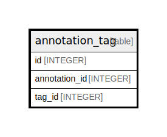

# annotation_tag

## Description

<details>
<summary><strong>Table Definition</strong></summary>

```sql
CREATE TABLE `annotation_tag` (
`id` INTEGER PRIMARY KEY AUTOINCREMENT NOT NULL
, `annotation_id` INTEGER NOT NULL
, `tag_id` INTEGER NOT NULL
)
```

</details>

## Columns

| Name | Type | Default | Nullable | Children | Parents | Comment |
| ---- | ---- | ------- | -------- | -------- | ------- | ------- |
| id | INTEGER |  | false |  |  |  |
| annotation_id | INTEGER |  | false |  |  |  |
| tag_id | INTEGER |  | false |  |  |  |

## Constraints

| Name | Type | Definition |
| ---- | ---- | ---------- |
| id | PRIMARY KEY | PRIMARY KEY (id) |

## Indexes

| Name | Definition |
| ---- | ---------- |
| UQE_annotation_tag_annotation_id_tag_id | CREATE UNIQUE INDEX `UQE_annotation_tag_annotation_id_tag_id` ON `annotation_tag` (`annotation_id`,`tag_id`) |

## Relations



---

> Generated by [tbls](https://github.com/k1LoW/tbls)
