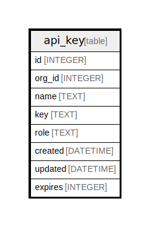

# api_key

## Description

<details>
<summary><strong>Table Definition</strong></summary>

```sql
CREATE TABLE `api_key` (
`id` INTEGER PRIMARY KEY AUTOINCREMENT NOT NULL
, `org_id` INTEGER NOT NULL
, `name` TEXT NOT NULL
, `key` TEXT NOT NULL
, `role` TEXT NOT NULL
, `created` DATETIME NOT NULL
, `updated` DATETIME NOT NULL
, `expires` INTEGER NULL)
```

</details>

## Columns

| Name | Type | Default | Nullable | Children | Parents | Comment |
| ---- | ---- | ------- | -------- | -------- | ------- | ------- |
| id | INTEGER |  | false |  |  |  |
| org_id | INTEGER |  | false |  |  |  |
| name | TEXT |  | false |  |  |  |
| key | TEXT |  | false |  |  |  |
| role | TEXT |  | false |  |  |  |
| created | DATETIME |  | false |  |  |  |
| updated | DATETIME |  | false |  |  |  |
| expires | INTEGER |  | true |  |  |  |

## Constraints

| Name | Type | Definition |
| ---- | ---- | ---------- |
| id | PRIMARY KEY | PRIMARY KEY (id) |

## Indexes

| Name | Definition |
| ---- | ---------- |
| UQE_api_key_org_id_name | CREATE UNIQUE INDEX `UQE_api_key_org_id_name` ON `api_key` (`org_id`,`name`) |
| UQE_api_key_key | CREATE UNIQUE INDEX `UQE_api_key_key` ON `api_key` (`key`) |
| IDX_api_key_org_id | CREATE INDEX `IDX_api_key_org_id` ON `api_key` (`org_id`) |

## Relations



---

> Generated by [tbls](https://github.com/k1LoW/tbls)
