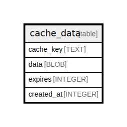

# cache_data

## Description

<details>
<summary><strong>Table Definition</strong></summary>

```sql
CREATE TABLE `cache_data` (
`cache_key` TEXT PRIMARY KEY NOT NULL
, `data` BLOB NOT NULL
, `expires` INTEGER NOT NULL
, `created_at` INTEGER NOT NULL
)
```

</details>

## Columns

| Name | Type | Default | Nullable | Children | Parents | Comment |
| ---- | ---- | ------- | -------- | -------- | ------- | ------- |
| cache_key | TEXT |  | false |  |  |  |
| data | BLOB |  | false |  |  |  |
| expires | INTEGER |  | false |  |  |  |
| created_at | INTEGER |  | false |  |  |  |

## Constraints

| Name | Type | Definition |
| ---- | ---- | ---------- |
| cache_key | PRIMARY KEY | PRIMARY KEY (cache_key) |
| sqlite_autoindex_cache_data_1 | PRIMARY KEY | PRIMARY KEY (cache_key) |

## Indexes

| Name | Definition |
| ---- | ---------- |
| UQE_cache_data_cache_key | CREATE UNIQUE INDEX `UQE_cache_data_cache_key` ON `cache_data` (`cache_key`) |
| sqlite_autoindex_cache_data_1 | PRIMARY KEY (cache_key) |

## Relations



---

> Generated by [tbls](https://github.com/k1LoW/tbls)
