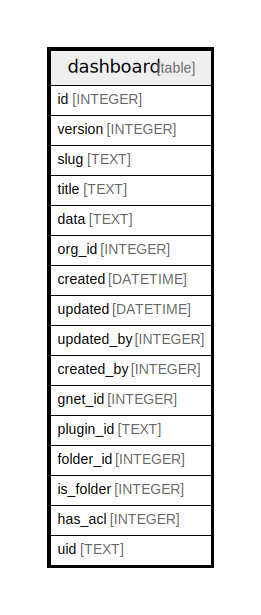

# dashboard

## Description

<details>
<summary><strong>Table Definition</strong></summary>

```sql
CREATE TABLE `dashboard` (
`id` INTEGER PRIMARY KEY AUTOINCREMENT NOT NULL
, `version` INTEGER NOT NULL
, `slug` TEXT NOT NULL
, `title` TEXT NOT NULL
, `data` TEXT NOT NULL
, `org_id` INTEGER NOT NULL
, `created` DATETIME NOT NULL
, `updated` DATETIME NOT NULL
, `updated_by` INTEGER NULL, `created_by` INTEGER NULL, `gnet_id` INTEGER NULL, `plugin_id` TEXT NULL, `folder_id` INTEGER NOT NULL DEFAULT 0, `is_folder` INTEGER NOT NULL DEFAULT 0, `has_acl` INTEGER NOT NULL DEFAULT 0, `uid` TEXT NULL)
```

</details>

## Columns

| Name | Type | Default | Nullable | Children | Parents | Comment |
| ---- | ---- | ------- | -------- | -------- | ------- | ------- |
| id | INTEGER |  | false |  |  |  |
| version | INTEGER |  | false |  |  |  |
| slug | TEXT |  | false |  |  |  |
| title | TEXT |  | false |  |  |  |
| data | TEXT |  | false |  |  |  |
| org_id | INTEGER |  | false |  |  |  |
| created | DATETIME |  | false |  |  |  |
| updated | DATETIME |  | false |  |  |  |
| updated_by | INTEGER |  | true |  |  |  |
| created_by | INTEGER |  | true |  |  |  |
| gnet_id | INTEGER |  | true |  |  |  |
| plugin_id | TEXT |  | true |  |  |  |
| folder_id | INTEGER | 0 | false |  |  |  |
| is_folder | INTEGER | 0 | false |  |  |  |
| has_acl | INTEGER | 0 | false |  |  |  |
| uid | TEXT |  | true |  |  |  |

## Constraints

| Name | Type | Definition |
| ---- | ---- | ---------- |
| id | PRIMARY KEY | PRIMARY KEY (id) |

## Indexes

| Name | Definition |
| ---- | ---------- |
| IDX_dashboard_title | CREATE INDEX `IDX_dashboard_title` ON `dashboard` (`title`) |
| UQE_dashboard_org_id_folder_id_title | CREATE UNIQUE INDEX `UQE_dashboard_org_id_folder_id_title` ON `dashboard` (`org_id`,`folder_id`,`title`) |
| UQE_dashboard_org_id_uid | CREATE UNIQUE INDEX `UQE_dashboard_org_id_uid` ON `dashboard` (`org_id`,`uid`) |
| IDX_dashboard_org_id_plugin_id | CREATE INDEX `IDX_dashboard_org_id_plugin_id` ON `dashboard` (`org_id`,`plugin_id`) |
| IDX_dashboard_gnet_id | CREATE INDEX `IDX_dashboard_gnet_id` ON `dashboard` (`gnet_id`) |
| IDX_dashboard_org_id | CREATE INDEX `IDX_dashboard_org_id` ON `dashboard` (`org_id`) |

## Relations



---

> Generated by [tbls](https://github.com/k1LoW/tbls)
