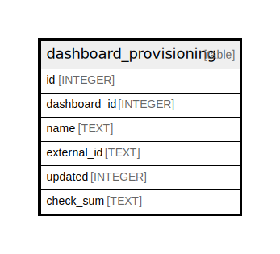

# dashboard_provisioning

## Description

<details>
<summary><strong>Table Definition</strong></summary>

```sql
CREATE TABLE `dashboard_provisioning` (
`id` INTEGER PRIMARY KEY AUTOINCREMENT NOT NULL
, `dashboard_id` INTEGER NULL
, `name` TEXT NOT NULL
, `external_id` TEXT NOT NULL
, `updated` INTEGER NOT NULL DEFAULT 0
, `check_sum` TEXT NULL)
```

</details>

## Columns

| Name | Type | Default | Nullable | Children | Parents | Comment |
| ---- | ---- | ------- | -------- | -------- | ------- | ------- |
| id | INTEGER |  | false |  |  |  |
| dashboard_id | INTEGER |  | true |  |  |  |
| name | TEXT |  | false |  |  |  |
| external_id | TEXT |  | false |  |  |  |
| updated | INTEGER | 0 | false |  |  |  |
| check_sum | TEXT |  | true |  |  |  |

## Constraints

| Name | Type | Definition |
| ---- | ---- | ---------- |
| id | PRIMARY KEY | PRIMARY KEY (id) |

## Indexes

| Name | Definition |
| ---- | ---------- |
| IDX_dashboard_provisioning_dashboard_id_name | CREATE INDEX `IDX_dashboard_provisioning_dashboard_id_name` ON `dashboard_provisioning` (`dashboard_id`,`name`) |
| IDX_dashboard_provisioning_dashboard_id | CREATE INDEX `IDX_dashboard_provisioning_dashboard_id` ON `dashboard_provisioning` (`dashboard_id`) |

## Relations



---

> Generated by [tbls](https://github.com/k1LoW/tbls)
