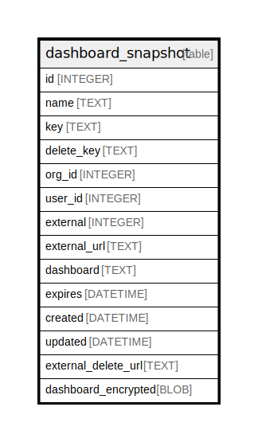

# dashboard_snapshot

## Description

<details>
<summary><strong>Table Definition</strong></summary>

```sql
CREATE TABLE `dashboard_snapshot` (
`id` INTEGER PRIMARY KEY AUTOINCREMENT NOT NULL
, `name` TEXT NOT NULL
, `key` TEXT NOT NULL
, `delete_key` TEXT NOT NULL
, `org_id` INTEGER NOT NULL
, `user_id` INTEGER NOT NULL
, `external` INTEGER NOT NULL
, `external_url` TEXT NOT NULL
, `dashboard` TEXT NOT NULL
, `expires` DATETIME NOT NULL
, `created` DATETIME NOT NULL
, `updated` DATETIME NOT NULL
, `external_delete_url` TEXT NULL, `dashboard_encrypted` BLOB NULL)
```

</details>

## Columns

| Name | Type | Default | Nullable | Children | Parents | Comment |
| ---- | ---- | ------- | -------- | -------- | ------- | ------- |
| id | INTEGER |  | false |  |  |  |
| name | TEXT |  | false |  |  |  |
| key | TEXT |  | false |  |  |  |
| delete_key | TEXT |  | false |  |  |  |
| org_id | INTEGER |  | false |  |  |  |
| user_id | INTEGER |  | false |  |  |  |
| external | INTEGER |  | false |  |  |  |
| external_url | TEXT |  | false |  |  |  |
| dashboard | TEXT |  | false |  |  |  |
| expires | DATETIME |  | false |  |  |  |
| created | DATETIME |  | false |  |  |  |
| updated | DATETIME |  | false |  |  |  |
| external_delete_url | TEXT |  | true |  |  |  |
| dashboard_encrypted | BLOB |  | true |  |  |  |

## Constraints

| Name | Type | Definition |
| ---- | ---- | ---------- |
| id | PRIMARY KEY | PRIMARY KEY (id) |

## Indexes

| Name | Definition |
| ---- | ---------- |
| IDX_dashboard_snapshot_user_id | CREATE INDEX `IDX_dashboard_snapshot_user_id` ON `dashboard_snapshot` (`user_id`) |
| UQE_dashboard_snapshot_delete_key | CREATE UNIQUE INDEX `UQE_dashboard_snapshot_delete_key` ON `dashboard_snapshot` (`delete_key`) |
| UQE_dashboard_snapshot_key | CREATE UNIQUE INDEX `UQE_dashboard_snapshot_key` ON `dashboard_snapshot` (`key`) |

## Relations



---

> Generated by [tbls](https://github.com/k1LoW/tbls)
