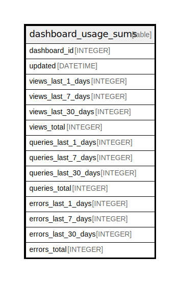

# dashboard_usage_sums

## Description

<details>
<summary><strong>Table Definition</strong></summary>

```sql
CREATE TABLE `dashboard_usage_sums` (
`dashboard_id` INTEGER PRIMARY KEY NOT NULL
, `updated` DATETIME NOT NULL
, `views_last_1_days` INTEGER NOT NULL
, `views_last_7_days` INTEGER NOT NULL
, `views_last_30_days` INTEGER NOT NULL
, `views_total` INTEGER NOT NULL
, `queries_last_1_days` INTEGER NOT NULL
, `queries_last_7_days` INTEGER NOT NULL
, `queries_last_30_days` INTEGER NOT NULL
, `queries_total` INTEGER NOT NULL
, `errors_last_1_days` INTEGER NOT NULL DEFAULT 0, `errors_last_7_days` INTEGER NOT NULL DEFAULT 0, `errors_last_30_days` INTEGER NOT NULL DEFAULT 0, `errors_total` INTEGER NOT NULL DEFAULT 0)
```

</details>

## Columns

| Name | Type | Default | Nullable | Children | Parents | Comment |
| ---- | ---- | ------- | -------- | -------- | ------- | ------- |
| dashboard_id | INTEGER |  | false |  |  |  |
| updated | DATETIME |  | false |  |  |  |
| views_last_1_days | INTEGER |  | false |  |  |  |
| views_last_7_days | INTEGER |  | false |  |  |  |
| views_last_30_days | INTEGER |  | false |  |  |  |
| views_total | INTEGER |  | false |  |  |  |
| queries_last_1_days | INTEGER |  | false |  |  |  |
| queries_last_7_days | INTEGER |  | false |  |  |  |
| queries_last_30_days | INTEGER |  | false |  |  |  |
| queries_total | INTEGER |  | false |  |  |  |
| errors_last_1_days | INTEGER | 0 | false |  |  |  |
| errors_last_7_days | INTEGER | 0 | false |  |  |  |
| errors_last_30_days | INTEGER | 0 | false |  |  |  |
| errors_total | INTEGER | 0 | false |  |  |  |

## Constraints

| Name | Type | Definition |
| ---- | ---- | ---------- |
| dashboard_id | PRIMARY KEY | PRIMARY KEY (dashboard_id) |

## Relations



---

> Generated by [tbls](https://github.com/k1LoW/tbls)
