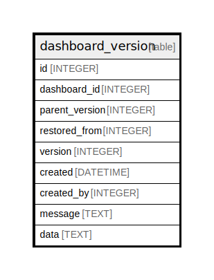

# dashboard_version

## Description

<details>
<summary><strong>Table Definition</strong></summary>

```sql
CREATE TABLE `dashboard_version` (
`id` INTEGER PRIMARY KEY AUTOINCREMENT NOT NULL
, `dashboard_id` INTEGER NOT NULL
, `parent_version` INTEGER NOT NULL
, `restored_from` INTEGER NOT NULL
, `version` INTEGER NOT NULL
, `created` DATETIME NOT NULL
, `created_by` INTEGER NOT NULL
, `message` TEXT NOT NULL
, `data` TEXT NOT NULL
)
```

</details>

## Columns

| Name | Type | Default | Nullable | Children | Parents | Comment |
| ---- | ---- | ------- | -------- | -------- | ------- | ------- |
| id | INTEGER |  | false |  |  |  |
| dashboard_id | INTEGER |  | false |  |  |  |
| parent_version | INTEGER |  | false |  |  |  |
| restored_from | INTEGER |  | false |  |  |  |
| version | INTEGER |  | false |  |  |  |
| created | DATETIME |  | false |  |  |  |
| created_by | INTEGER |  | false |  |  |  |
| message | TEXT |  | false |  |  |  |
| data | TEXT |  | false |  |  |  |

## Constraints

| Name | Type | Definition |
| ---- | ---- | ---------- |
| id | PRIMARY KEY | PRIMARY KEY (id) |

## Indexes

| Name | Definition |
| ---- | ---------- |
| UQE_dashboard_version_dashboard_id_version | CREATE UNIQUE INDEX `UQE_dashboard_version_dashboard_id_version` ON `dashboard_version` (`dashboard_id`,`version`) |
| IDX_dashboard_version_dashboard_id | CREATE INDEX `IDX_dashboard_version_dashboard_id` ON `dashboard_version` (`dashboard_id`) |

## Relations



---

> Generated by [tbls](https://github.com/k1LoW/tbls)
