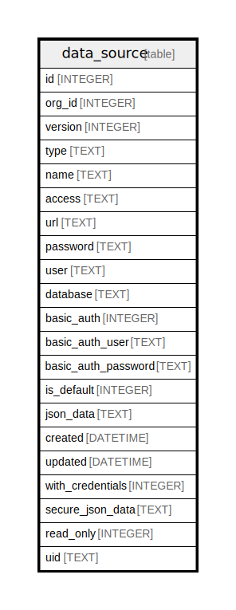

# data_source

## Description

<details>
<summary><strong>Table Definition</strong></summary>

```sql
CREATE TABLE `data_source` (
`id` INTEGER PRIMARY KEY AUTOINCREMENT NOT NULL
, `org_id` INTEGER NOT NULL
, `version` INTEGER NOT NULL
, `type` TEXT NOT NULL
, `name` TEXT NOT NULL
, `access` TEXT NOT NULL
, `url` TEXT NOT NULL
, `password` TEXT NULL
, `user` TEXT NULL
, `database` TEXT NULL
, `basic_auth` INTEGER NOT NULL
, `basic_auth_user` TEXT NULL
, `basic_auth_password` TEXT NULL
, `is_default` INTEGER NOT NULL
, `json_data` TEXT NULL
, `created` DATETIME NOT NULL
, `updated` DATETIME NOT NULL
, `with_credentials` INTEGER NOT NULL DEFAULT 0, `secure_json_data` TEXT NULL, `read_only` INTEGER NULL, `uid` TEXT NOT NULL DEFAULT 0)
```

</details>

## Columns

| Name | Type | Default | Nullable | Children | Parents | Comment |
| ---- | ---- | ------- | -------- | -------- | ------- | ------- |
| id | INTEGER |  | false |  |  |  |
| org_id | INTEGER |  | false |  |  |  |
| version | INTEGER |  | false |  |  |  |
| type | TEXT |  | false |  |  |  |
| name | TEXT |  | false |  |  |  |
| access | TEXT |  | false |  |  |  |
| url | TEXT |  | false |  |  |  |
| password | TEXT |  | true |  |  |  |
| user | TEXT |  | true |  |  |  |
| database | TEXT |  | true |  |  |  |
| basic_auth | INTEGER |  | false |  |  |  |
| basic_auth_user | TEXT |  | true |  |  |  |
| basic_auth_password | TEXT |  | true |  |  |  |
| is_default | INTEGER |  | false |  |  |  |
| json_data | TEXT |  | true |  |  |  |
| created | DATETIME |  | false |  |  |  |
| updated | DATETIME |  | false |  |  |  |
| with_credentials | INTEGER | 0 | false |  |  |  |
| secure_json_data | TEXT |  | true |  |  |  |
| read_only | INTEGER |  | true |  |  |  |
| uid | TEXT | 0 | false |  |  |  |

## Constraints

| Name | Type | Definition |
| ---- | ---- | ---------- |
| id | PRIMARY KEY | PRIMARY KEY (id) |

## Indexes

| Name | Definition |
| ---- | ---------- |
| IDX_data_source_org_id_is_default | CREATE INDEX `IDX_data_source_org_id_is_default` ON `data_source` (`org_id`,`is_default`) |
| UQE_data_source_org_id_uid | CREATE UNIQUE INDEX `UQE_data_source_org_id_uid` ON `data_source` (`org_id`,`uid`) |
| UQE_data_source_org_id_name | CREATE UNIQUE INDEX `UQE_data_source_org_id_name` ON `data_source` (`org_id`,`name`) |
| IDX_data_source_org_id | CREATE INDEX `IDX_data_source_org_id` ON `data_source` (`org_id`) |

## Relations



---

> Generated by [tbls](https://github.com/k1LoW/tbls)
