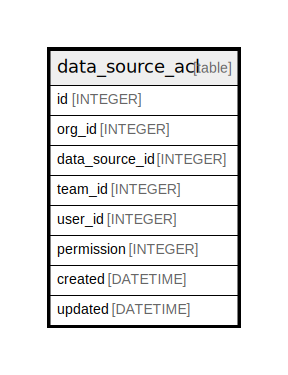

# data_source_acl

## Description

<details>
<summary><strong>Table Definition</strong></summary>

```sql
CREATE TABLE `data_source_acl` (
`id` INTEGER PRIMARY KEY AUTOINCREMENT NOT NULL
, `org_id` INTEGER NOT NULL
, `data_source_id` INTEGER NOT NULL
, `team_id` INTEGER NOT NULL
, `user_id` INTEGER NOT NULL
, `permission` INTEGER NOT NULL
, `created` DATETIME NOT NULL
, `updated` DATETIME NOT NULL
)
```

</details>

## Columns

| Name | Type | Default | Nullable | Children | Parents | Comment |
| ---- | ---- | ------- | -------- | -------- | ------- | ------- |
| id | INTEGER |  | false |  |  |  |
| org_id | INTEGER |  | false |  |  |  |
| data_source_id | INTEGER |  | false |  |  |  |
| team_id | INTEGER |  | false |  |  |  |
| user_id | INTEGER |  | false |  |  |  |
| permission | INTEGER |  | false |  |  |  |
| created | DATETIME |  | false |  |  |  |
| updated | DATETIME |  | false |  |  |  |

## Constraints

| Name | Type | Definition |
| ---- | ---- | ---------- |
| id | PRIMARY KEY | PRIMARY KEY (id) |

## Indexes

| Name | Definition |
| ---- | ---------- |
| UQE_data_source_acl_data_source_id_team_id_user_id | CREATE UNIQUE INDEX `UQE_data_source_acl_data_source_id_team_id_user_id` ON `data_source_acl` (`data_source_id`,`team_id`,`user_id`) |
| IDX_data_source_acl_data_source_id | CREATE INDEX `IDX_data_source_acl_data_source_id` ON `data_source_acl` (`data_source_id`) |

## Relations



---

> Generated by [tbls](https://github.com/k1LoW/tbls)
