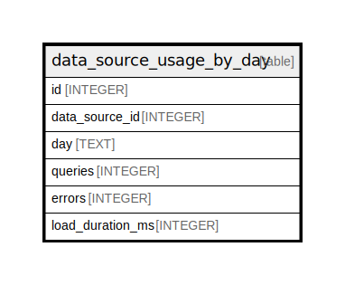

# data_source_usage_by_day

## Description

<details>
<summary><strong>Table Definition</strong></summary>

```sql
CREATE TABLE `data_source_usage_by_day` (
`id` INTEGER PRIMARY KEY AUTOINCREMENT NOT NULL
, `data_source_id` INTEGER NOT NULL
, `day` TEXT NOT NULL
, `queries` INTEGER NOT NULL
, `errors` INTEGER NOT NULL
, `load_duration_ms` INTEGER NOT NULL
)
```

</details>

## Columns

| Name | Type | Default | Nullable | Children | Parents | Comment |
| ---- | ---- | ------- | -------- | -------- | ------- | ------- |
| id | INTEGER |  | false |  |  |  |
| data_source_id | INTEGER |  | false |  |  |  |
| day | TEXT |  | false |  |  |  |
| queries | INTEGER |  | false |  |  |  |
| errors | INTEGER |  | false |  |  |  |
| load_duration_ms | INTEGER |  | false |  |  |  |

## Constraints

| Name | Type | Definition |
| ---- | ---- | ---------- |
| id | PRIMARY KEY | PRIMARY KEY (id) |

## Indexes

| Name | Definition |
| ---- | ---------- |
| UQE_data_source_usage_by_day_data_source_id_day | CREATE UNIQUE INDEX `UQE_data_source_usage_by_day_data_source_id_day` ON `data_source_usage_by_day` (`data_source_id`,`day`) |
| IDX_data_source_usage_by_day_data_source_id | CREATE INDEX `IDX_data_source_usage_by_day_data_source_id` ON `data_source_usage_by_day` (`data_source_id`) |

## Relations



---

> Generated by [tbls](https://github.com/k1LoW/tbls)
