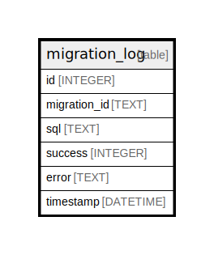

# migration_log

## Description

<details>
<summary><strong>Table Definition</strong></summary>

```sql
CREATE TABLE `migration_log` (
`id` INTEGER PRIMARY KEY AUTOINCREMENT NOT NULL
, `migration_id` TEXT NOT NULL
, `sql` TEXT NOT NULL
, `success` INTEGER NOT NULL
, `error` TEXT NOT NULL
, `timestamp` DATETIME NOT NULL
)
```

</details>

## Columns

| Name | Type | Default | Nullable | Children | Parents | Comment |
| ---- | ---- | ------- | -------- | -------- | ------- | ------- |
| id | INTEGER |  | false |  |  |  |
| migration_id | TEXT |  | false |  |  |  |
| sql | TEXT |  | false |  |  |  |
| success | INTEGER |  | false |  |  |  |
| error | TEXT |  | false |  |  |  |
| timestamp | DATETIME |  | false |  |  |  |

## Constraints

| Name | Type | Definition |
| ---- | ---- | ---------- |
| id | PRIMARY KEY | PRIMARY KEY (id) |

## Relations



---

> Generated by [tbls](https://github.com/k1LoW/tbls)
