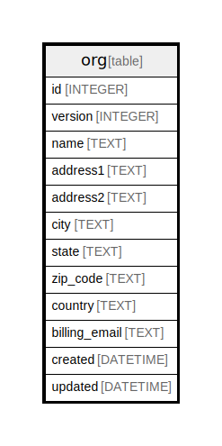

# org

## Description

<details>
<summary><strong>Table Definition</strong></summary>

```sql
CREATE TABLE `org` (
`id` INTEGER PRIMARY KEY AUTOINCREMENT NOT NULL
, `version` INTEGER NOT NULL
, `name` TEXT NOT NULL
, `address1` TEXT NULL
, `address2` TEXT NULL
, `city` TEXT NULL
, `state` TEXT NULL
, `zip_code` TEXT NULL
, `country` TEXT NULL
, `billing_email` TEXT NULL
, `created` DATETIME NOT NULL
, `updated` DATETIME NOT NULL
)
```

</details>

## Columns

| Name | Type | Default | Nullable | Children | Parents | Comment |
| ---- | ---- | ------- | -------- | -------- | ------- | ------- |
| id | INTEGER |  | false |  |  |  |
| version | INTEGER |  | false |  |  |  |
| name | TEXT |  | false |  |  |  |
| address1 | TEXT |  | true |  |  |  |
| address2 | TEXT |  | true |  |  |  |
| city | TEXT |  | true |  |  |  |
| state | TEXT |  | true |  |  |  |
| zip_code | TEXT |  | true |  |  |  |
| country | TEXT |  | true |  |  |  |
| billing_email | TEXT |  | true |  |  |  |
| created | DATETIME |  | false |  |  |  |
| updated | DATETIME |  | false |  |  |  |

## Constraints

| Name | Type | Definition |
| ---- | ---- | ---------- |
| id | PRIMARY KEY | PRIMARY KEY (id) |

## Indexes

| Name | Definition |
| ---- | ---------- |
| UQE_org_name | CREATE UNIQUE INDEX `UQE_org_name` ON `org` (`name`) |

## Relations



---

> Generated by [tbls](https://github.com/k1LoW/tbls)
