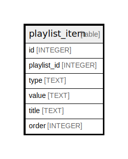

# playlist_item

## Description

<details>
<summary><strong>Table Definition</strong></summary>

```sql
CREATE TABLE `playlist_item` (
`id` INTEGER PRIMARY KEY AUTOINCREMENT NOT NULL
, `playlist_id` INTEGER NOT NULL
, `type` TEXT NOT NULL
, `value` TEXT NOT NULL
, `title` TEXT NOT NULL
, `order` INTEGER NOT NULL
)
```

</details>

## Columns

| Name | Type | Default | Nullable | Children | Parents | Comment |
| ---- | ---- | ------- | -------- | -------- | ------- | ------- |
| id | INTEGER |  | false |  |  |  |
| playlist_id | INTEGER |  | false |  |  |  |
| type | TEXT |  | false |  |  |  |
| value | TEXT |  | false |  |  |  |
| title | TEXT |  | false |  |  |  |
| order | INTEGER |  | false |  |  |  |

## Constraints

| Name | Type | Definition |
| ---- | ---- | ---------- |
| id | PRIMARY KEY | PRIMARY KEY (id) |

## Relations



---

> Generated by [tbls](https://github.com/k1LoW/tbls)
