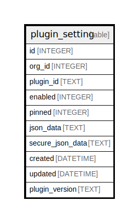

# plugin_setting

## Description

<details>
<summary><strong>Table Definition</strong></summary>

```sql
CREATE TABLE `plugin_setting` (
`id` INTEGER PRIMARY KEY AUTOINCREMENT NOT NULL
, `org_id` INTEGER NULL
, `plugin_id` TEXT NOT NULL
, `enabled` INTEGER NOT NULL
, `pinned` INTEGER NOT NULL
, `json_data` TEXT NULL
, `secure_json_data` TEXT NULL
, `created` DATETIME NOT NULL
, `updated` DATETIME NOT NULL
, `plugin_version` TEXT NULL)
```

</details>

## Columns

| Name | Type | Default | Nullable | Children | Parents | Comment |
| ---- | ---- | ------- | -------- | -------- | ------- | ------- |
| id | INTEGER |  | false |  |  |  |
| org_id | INTEGER |  | true |  |  |  |
| plugin_id | TEXT |  | false |  |  |  |
| enabled | INTEGER |  | false |  |  |  |
| pinned | INTEGER |  | false |  |  |  |
| json_data | TEXT |  | true |  |  |  |
| secure_json_data | TEXT |  | true |  |  |  |
| created | DATETIME |  | false |  |  |  |
| updated | DATETIME |  | false |  |  |  |
| plugin_version | TEXT |  | true |  |  |  |

## Constraints

| Name | Type | Definition |
| ---- | ---- | ---------- |
| id | PRIMARY KEY | PRIMARY KEY (id) |

## Indexes

| Name | Definition |
| ---- | ---------- |
| UQE_plugin_setting_org_id_plugin_id | CREATE UNIQUE INDEX `UQE_plugin_setting_org_id_plugin_id` ON `plugin_setting` (`org_id`,`plugin_id`) |

## Relations



---

> Generated by [tbls](https://github.com/k1LoW/tbls)
