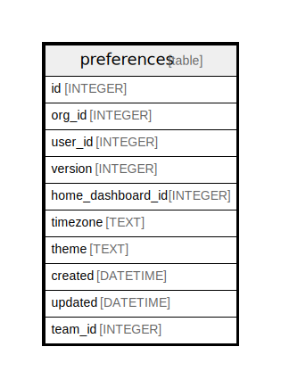

# preferences

## Description

<details>
<summary><strong>Table Definition</strong></summary>

```sql
CREATE TABLE `preferences` (
`id` INTEGER PRIMARY KEY AUTOINCREMENT NOT NULL
, `org_id` INTEGER NOT NULL
, `user_id` INTEGER NOT NULL
, `version` INTEGER NOT NULL
, `home_dashboard_id` INTEGER NOT NULL
, `timezone` TEXT NOT NULL
, `theme` TEXT NOT NULL
, `created` DATETIME NOT NULL
, `updated` DATETIME NOT NULL
, `team_id` INTEGER NULL)
```

</details>

## Columns

| Name | Type | Default | Nullable | Children | Parents | Comment |
| ---- | ---- | ------- | -------- | -------- | ------- | ------- |
| id | INTEGER |  | false |  |  |  |
| org_id | INTEGER |  | false |  |  |  |
| user_id | INTEGER |  | false |  |  |  |
| version | INTEGER |  | false |  |  |  |
| home_dashboard_id | INTEGER |  | false |  |  |  |
| timezone | TEXT |  | false |  |  |  |
| theme | TEXT |  | false |  |  |  |
| created | DATETIME |  | false |  |  |  |
| updated | DATETIME |  | false |  |  |  |
| team_id | INTEGER |  | true |  |  |  |

## Constraints

| Name | Type | Definition |
| ---- | ---- | ---------- |
| id | PRIMARY KEY | PRIMARY KEY (id) |

## Relations



---

> Generated by [tbls](https://github.com/k1LoW/tbls)
