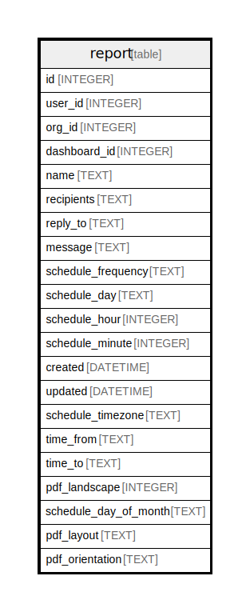

# report

## Description

<details>
<summary><strong>Table Definition</strong></summary>

```sql
CREATE TABLE `report` (
`id` INTEGER PRIMARY KEY AUTOINCREMENT NOT NULL
, `user_id` INTEGER NOT NULL
, `org_id` INTEGER NOT NULL
, `dashboard_id` INTEGER NOT NULL
, `name` TEXT NOT NULL
, `recipients` TEXT NOT NULL
, `reply_to` TEXT NULL
, `message` TEXT NULL
, `schedule_frequency` TEXT NOT NULL
, `schedule_day` TEXT NOT NULL
, `schedule_hour` INTEGER NOT NULL
, `schedule_minute` INTEGER NOT NULL
, `created` DATETIME NOT NULL
, `updated` DATETIME NOT NULL
, `schedule_timezone` TEXT NOT NULL DEFAULT 'Europe/Stockholm', `time_from` TEXT NULL, `time_to` TEXT NULL, `pdf_landscape` INTEGER NULL, `schedule_day_of_month` TEXT NULL, `pdf_layout` TEXT NULL, `pdf_orientation` TEXT NULL)
```

</details>

## Columns

| Name | Type | Default | Nullable | Children | Parents | Comment |
| ---- | ---- | ------- | -------- | -------- | ------- | ------- |
| id | INTEGER |  | false |  |  |  |
| user_id | INTEGER |  | false |  |  |  |
| org_id | INTEGER |  | false |  |  |  |
| dashboard_id | INTEGER |  | false |  |  |  |
| name | TEXT |  | false |  |  |  |
| recipients | TEXT |  | false |  |  |  |
| reply_to | TEXT |  | true |  |  |  |
| message | TEXT |  | true |  |  |  |
| schedule_frequency | TEXT |  | false |  |  |  |
| schedule_day | TEXT |  | false |  |  |  |
| schedule_hour | INTEGER |  | false |  |  |  |
| schedule_minute | INTEGER |  | false |  |  |  |
| created | DATETIME |  | false |  |  |  |
| updated | DATETIME |  | false |  |  |  |
| schedule_timezone | TEXT | 'Europe/Stockholm' | false |  |  |  |
| time_from | TEXT |  | true |  |  |  |
| time_to | TEXT |  | true |  |  |  |
| pdf_landscape | INTEGER |  | true |  |  |  |
| schedule_day_of_month | TEXT |  | true |  |  |  |
| pdf_layout | TEXT |  | true |  |  |  |
| pdf_orientation | TEXT |  | true |  |  |  |

## Constraints

| Name | Type | Definition |
| ---- | ---- | ---------- |
| id | PRIMARY KEY | PRIMARY KEY (id) |

## Indexes

| Name | Definition |
| ---- | ---------- |
| IDX_report_org_id | CREATE INDEX `IDX_report_org_id` ON `report` (`org_id`) |
| IDX_report_dashboard_id | CREATE INDEX `IDX_report_dashboard_id` ON `report` (`dashboard_id`) |
| IDX_report_user_id | CREATE INDEX `IDX_report_user_id` ON `report` (`user_id`) |

## Relations



---

> Generated by [tbls](https://github.com/k1LoW/tbls)
