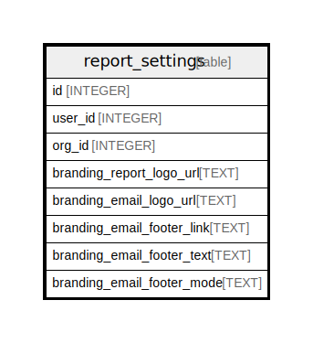

# report_settings

## Description

<details>
<summary><strong>Table Definition</strong></summary>

```sql
CREATE TABLE `report_settings` (
`id` INTEGER PRIMARY KEY AUTOINCREMENT NOT NULL
, `user_id` INTEGER NOT NULL
, `org_id` INTEGER NOT NULL
, `branding_report_logo_url` TEXT NULL
, `branding_email_logo_url` TEXT NULL
, `branding_email_footer_link` TEXT NULL
, `branding_email_footer_text` TEXT NULL
, `branding_email_footer_mode` TEXT NULL
)
```

</details>

## Columns

| Name | Type | Default | Nullable | Children | Parents | Comment |
| ---- | ---- | ------- | -------- | -------- | ------- | ------- |
| id | INTEGER |  | false |  |  |  |
| user_id | INTEGER |  | false |  |  |  |
| org_id | INTEGER |  | false |  |  |  |
| branding_report_logo_url | TEXT |  | true |  |  |  |
| branding_email_logo_url | TEXT |  | true |  |  |  |
| branding_email_footer_link | TEXT |  | true |  |  |  |
| branding_email_footer_text | TEXT |  | true |  |  |  |
| branding_email_footer_mode | TEXT |  | true |  |  |  |

## Constraints

| Name | Type | Definition |
| ---- | ---- | ---------- |
| id | PRIMARY KEY | PRIMARY KEY (id) |

## Relations



---

> Generated by [tbls](https://github.com/k1LoW/tbls)
