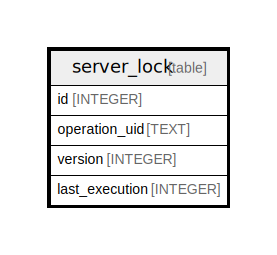

# server_lock

## Description

<details>
<summary><strong>Table Definition</strong></summary>

```sql
CREATE TABLE `server_lock` (
`id` INTEGER PRIMARY KEY AUTOINCREMENT NOT NULL
, `operation_uid` TEXT NOT NULL
, `version` INTEGER NOT NULL
, `last_execution` INTEGER NOT NULL
)
```

</details>

## Columns

| Name | Type | Default | Nullable | Children | Parents | Comment |
| ---- | ---- | ------- | -------- | -------- | ------- | ------- |
| id | INTEGER |  | false |  |  |  |
| operation_uid | TEXT |  | false |  |  |  |
| version | INTEGER |  | false |  |  |  |
| last_execution | INTEGER |  | false |  |  |  |

## Constraints

| Name | Type | Definition |
| ---- | ---- | ---------- |
| id | PRIMARY KEY | PRIMARY KEY (id) |

## Indexes

| Name | Definition |
| ---- | ---------- |
| UQE_server_lock_operation_uid | CREATE UNIQUE INDEX `UQE_server_lock_operation_uid` ON `server_lock` (`operation_uid`) |

## Relations



---

> Generated by [tbls](https://github.com/k1LoW/tbls)
