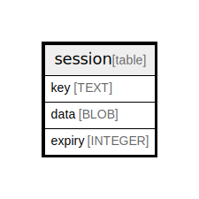

# session

## Description

<details>
<summary><strong>Table Definition</strong></summary>

```sql
CREATE TABLE `session` (
`key` TEXT PRIMARY KEY NOT NULL
, `data` BLOB NOT NULL
, `expiry` INTEGER NOT NULL
)
```

</details>

## Columns

| Name | Type | Default | Nullable | Children | Parents | Comment |
| ---- | ---- | ------- | -------- | -------- | ------- | ------- |
| key | TEXT |  | false |  |  |  |
| data | BLOB |  | false |  |  |  |
| expiry | INTEGER |  | false |  |  |  |

## Constraints

| Name | Type | Definition |
| ---- | ---- | ---------- |
| key | PRIMARY KEY | PRIMARY KEY (key) |
| sqlite_autoindex_session_1 | PRIMARY KEY | PRIMARY KEY (key) |

## Indexes

| Name | Definition |
| ---- | ---------- |
| sqlite_autoindex_session_1 | PRIMARY KEY (key) |

## Relations



---

> Generated by [tbls](https://github.com/k1LoW/tbls)
