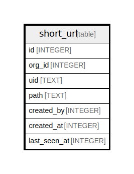

# short_url

## Description

<details>
<summary><strong>Table Definition</strong></summary>

```sql
CREATE TABLE `short_url` (
`id` INTEGER PRIMARY KEY AUTOINCREMENT NOT NULL
, `org_id` INTEGER NOT NULL
, `uid` TEXT NOT NULL
, `path` TEXT NOT NULL
, `created_by` INTEGER NOT NULL
, `created_at` INTEGER NOT NULL
, `last_seen_at` INTEGER NULL
)
```

</details>

## Columns

| Name | Type | Default | Nullable | Children | Parents | Comment |
| ---- | ---- | ------- | -------- | -------- | ------- | ------- |
| id | INTEGER |  | false |  |  |  |
| org_id | INTEGER |  | false |  |  |  |
| uid | TEXT |  | false |  |  |  |
| path | TEXT |  | false |  |  |  |
| created_by | INTEGER |  | false |  |  |  |
| created_at | INTEGER |  | false |  |  |  |
| last_seen_at | INTEGER |  | true |  |  |  |

## Constraints

| Name | Type | Definition |
| ---- | ---- | ---------- |
| id | PRIMARY KEY | PRIMARY KEY (id) |

## Indexes

| Name | Definition |
| ---- | ---------- |
| UQE_short_url_org_id_uid | CREATE UNIQUE INDEX `UQE_short_url_org_id_uid` ON `short_url` (`org_id`,`uid`) |

## Relations



---

> Generated by [tbls](https://github.com/k1LoW/tbls)
