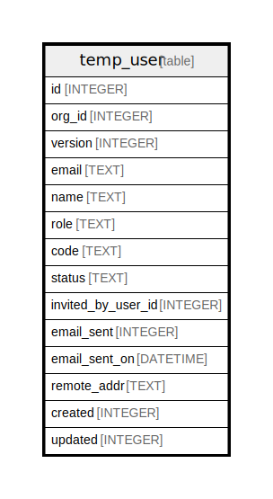

# temp_user

## Description

<details>
<summary><strong>Table Definition</strong></summary>

```sql
CREATE TABLE `temp_user` (
`id` INTEGER PRIMARY KEY AUTOINCREMENT NOT NULL
, `org_id` INTEGER NOT NULL
, `version` INTEGER NOT NULL
, `email` TEXT NOT NULL
, `name` TEXT NULL
, `role` TEXT NULL
, `code` TEXT NOT NULL
, `status` TEXT NOT NULL
, `invited_by_user_id` INTEGER NULL
, `email_sent` INTEGER NOT NULL
, `email_sent_on` DATETIME NULL
, `remote_addr` TEXT NULL
, `created` INTEGER NOT NULL DEFAULT 0
, `updated` INTEGER NOT NULL DEFAULT 0
)
```

</details>

## Columns

| Name | Type | Default | Nullable | Children | Parents | Comment |
| ---- | ---- | ------- | -------- | -------- | ------- | ------- |
| id | INTEGER |  | false |  |  |  |
| org_id | INTEGER |  | false |  |  |  |
| version | INTEGER |  | false |  |  |  |
| email | TEXT |  | false |  |  |  |
| name | TEXT |  | true |  |  |  |
| role | TEXT |  | true |  |  |  |
| code | TEXT |  | false |  |  |  |
| status | TEXT |  | false |  |  |  |
| invited_by_user_id | INTEGER |  | true |  |  |  |
| email_sent | INTEGER |  | false |  |  |  |
| email_sent_on | DATETIME |  | true |  |  |  |
| remote_addr | TEXT |  | true |  |  |  |
| created | INTEGER | 0 | false |  |  |  |
| updated | INTEGER | 0 | false |  |  |  |

## Constraints

| Name | Type | Definition |
| ---- | ---- | ---------- |
| id | PRIMARY KEY | PRIMARY KEY (id) |

## Indexes

| Name | Definition |
| ---- | ---------- |
| IDX_temp_user_status | CREATE INDEX `IDX_temp_user_status` ON `temp_user` (`status`) |
| IDX_temp_user_code | CREATE INDEX `IDX_temp_user_code` ON `temp_user` (`code`) |
| IDX_temp_user_org_id | CREATE INDEX `IDX_temp_user_org_id` ON `temp_user` (`org_id`) |
| IDX_temp_user_email | CREATE INDEX `IDX_temp_user_email` ON `temp_user` (`email`) |

## Relations



---

> Generated by [tbls](https://github.com/k1LoW/tbls)
