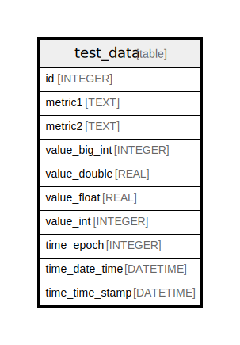

# test_data

## Description

<details>
<summary><strong>Table Definition</strong></summary>

```sql
CREATE TABLE `test_data` (
`id` INTEGER PRIMARY KEY AUTOINCREMENT NOT NULL
, `metric1` TEXT NULL
, `metric2` TEXT NULL
, `value_big_int` INTEGER NULL
, `value_double` REAL NULL
, `value_float` REAL NULL
, `value_int` INTEGER NULL
, `time_epoch` INTEGER NOT NULL
, `time_date_time` DATETIME NOT NULL
, `time_time_stamp` DATETIME NOT NULL
)
```

</details>

## Columns

| Name | Type | Default | Nullable | Children | Parents | Comment |
| ---- | ---- | ------- | -------- | -------- | ------- | ------- |
| id | INTEGER |  | false |  |  |  |
| metric1 | TEXT |  | true |  |  |  |
| metric2 | TEXT |  | true |  |  |  |
| value_big_int | INTEGER |  | true |  |  |  |
| value_double | REAL |  | true |  |  |  |
| value_float | REAL |  | true |  |  |  |
| value_int | INTEGER |  | true |  |  |  |
| time_epoch | INTEGER |  | false |  |  |  |
| time_date_time | DATETIME |  | false |  |  |  |
| time_time_stamp | DATETIME |  | false |  |  |  |

## Constraints

| Name | Type | Definition |
| ---- | ---- | ---------- |
| id | PRIMARY KEY | PRIMARY KEY (id) |

## Relations



---

> Generated by [tbls](https://github.com/k1LoW/tbls)
