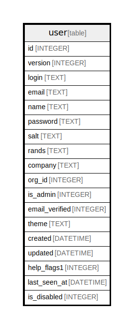

# user

## Description

<details>
<summary><strong>Table Definition</strong></summary>

```sql
CREATE TABLE `user` (
`id` INTEGER PRIMARY KEY AUTOINCREMENT NOT NULL
, `version` INTEGER NOT NULL
, `login` TEXT NOT NULL
, `email` TEXT NOT NULL
, `name` TEXT NULL
, `password` TEXT NULL
, `salt` TEXT NULL
, `rands` TEXT NULL
, `company` TEXT NULL
, `org_id` INTEGER NOT NULL
, `is_admin` INTEGER NOT NULL
, `email_verified` INTEGER NULL
, `theme` TEXT NULL
, `created` DATETIME NOT NULL
, `updated` DATETIME NOT NULL
, `help_flags1` INTEGER NOT NULL DEFAULT 0, `last_seen_at` DATETIME NULL, `is_disabled` INTEGER NOT NULL DEFAULT 0)
```

</details>

## Columns

| Name | Type | Default | Nullable | Children | Parents | Comment |
| ---- | ---- | ------- | -------- | -------- | ------- | ------- |
| id | INTEGER |  | false |  |  |  |
| version | INTEGER |  | false |  |  |  |
| login | TEXT |  | false |  |  |  |
| email | TEXT |  | false |  |  |  |
| name | TEXT |  | true |  |  |  |
| password | TEXT |  | true |  |  |  |
| salt | TEXT |  | true |  |  |  |
| rands | TEXT |  | true |  |  |  |
| company | TEXT |  | true |  |  |  |
| org_id | INTEGER |  | false |  |  |  |
| is_admin | INTEGER |  | false |  |  |  |
| email_verified | INTEGER |  | true |  |  |  |
| theme | TEXT |  | true |  |  |  |
| created | DATETIME |  | false |  |  |  |
| updated | DATETIME |  | false |  |  |  |
| help_flags1 | INTEGER | 0 | false |  |  |  |
| last_seen_at | DATETIME |  | true |  |  |  |
| is_disabled | INTEGER | 0 | false |  |  |  |

## Constraints

| Name | Type | Definition |
| ---- | ---- | ---------- |
| id | PRIMARY KEY | PRIMARY KEY (id) |

## Indexes

| Name | Definition |
| ---- | ---------- |
| IDX_user_login_email | CREATE INDEX `IDX_user_login_email` ON `user` (`login`,`email`) |
| UQE_user_email | CREATE UNIQUE INDEX `UQE_user_email` ON `user` (`email`) |
| UQE_user_login | CREATE UNIQUE INDEX `UQE_user_login` ON `user` (`login`) |

## Relations



---

> Generated by [tbls](https://github.com/k1LoW/tbls)
