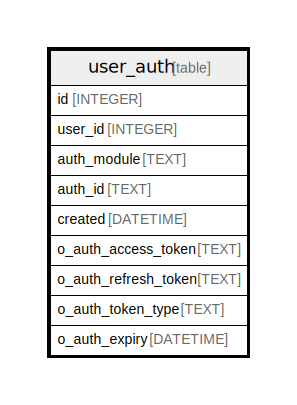

# user_auth

## Description

<details>
<summary><strong>Table Definition</strong></summary>

```sql
CREATE TABLE `user_auth` (
`id` INTEGER PRIMARY KEY AUTOINCREMENT NOT NULL
, `user_id` INTEGER NOT NULL
, `auth_module` TEXT NOT NULL
, `auth_id` TEXT NOT NULL
, `created` DATETIME NOT NULL
, `o_auth_access_token` TEXT NULL, `o_auth_refresh_token` TEXT NULL, `o_auth_token_type` TEXT NULL, `o_auth_expiry` DATETIME NULL)
```

</details>

## Columns

| Name | Type | Default | Nullable | Children | Parents | Comment |
| ---- | ---- | ------- | -------- | -------- | ------- | ------- |
| id | INTEGER |  | false |  |  |  |
| user_id | INTEGER |  | false |  |  |  |
| auth_module | TEXT |  | false |  |  |  |
| auth_id | TEXT |  | false |  |  |  |
| created | DATETIME |  | false |  |  |  |
| o_auth_access_token | TEXT |  | true |  |  |  |
| o_auth_refresh_token | TEXT |  | true |  |  |  |
| o_auth_token_type | TEXT |  | true |  |  |  |
| o_auth_expiry | DATETIME |  | true |  |  |  |

## Constraints

| Name | Type | Definition |
| ---- | ---- | ---------- |
| id | PRIMARY KEY | PRIMARY KEY (id) |

## Indexes

| Name | Definition |
| ---- | ---------- |
| IDX_user_auth_user_id | CREATE INDEX `IDX_user_auth_user_id` ON `user_auth` (`user_id`) |
| IDX_user_auth_auth_module_auth_id | CREATE INDEX `IDX_user_auth_auth_module_auth_id` ON `user_auth` (`auth_module`,`auth_id`) |

## Relations



---

> Generated by [tbls](https://github.com/k1LoW/tbls)
