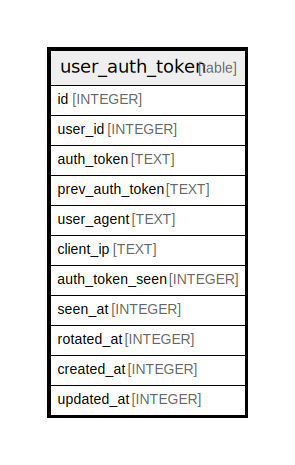

# user_auth_token

## Description

<details>
<summary><strong>Table Definition</strong></summary>

```sql
CREATE TABLE `user_auth_token` (
`id` INTEGER PRIMARY KEY AUTOINCREMENT NOT NULL
, `user_id` INTEGER NOT NULL
, `auth_token` TEXT NOT NULL
, `prev_auth_token` TEXT NOT NULL
, `user_agent` TEXT NOT NULL
, `client_ip` TEXT NOT NULL
, `auth_token_seen` INTEGER NOT NULL
, `seen_at` INTEGER NULL
, `rotated_at` INTEGER NOT NULL
, `created_at` INTEGER NOT NULL
, `updated_at` INTEGER NOT NULL
)
```

</details>

## Columns

| Name | Type | Default | Nullable | Children | Parents | Comment |
| ---- | ---- | ------- | -------- | -------- | ------- | ------- |
| id | INTEGER |  | false |  |  |  |
| user_id | INTEGER |  | false |  |  |  |
| auth_token | TEXT |  | false |  |  |  |
| prev_auth_token | TEXT |  | false |  |  |  |
| user_agent | TEXT |  | false |  |  |  |
| client_ip | TEXT |  | false |  |  |  |
| auth_token_seen | INTEGER |  | false |  |  |  |
| seen_at | INTEGER |  | true |  |  |  |
| rotated_at | INTEGER |  | false |  |  |  |
| created_at | INTEGER |  | false |  |  |  |
| updated_at | INTEGER |  | false |  |  |  |

## Constraints

| Name | Type | Definition |
| ---- | ---- | ---------- |
| id | PRIMARY KEY | PRIMARY KEY (id) |

## Indexes

| Name | Definition |
| ---- | ---------- |
| IDX_user_auth_token_user_id | CREATE INDEX `IDX_user_auth_token_user_id` ON `user_auth_token` (`user_id`) |
| UQE_user_auth_token_prev_auth_token | CREATE UNIQUE INDEX `UQE_user_auth_token_prev_auth_token` ON `user_auth_token` (`prev_auth_token`) |
| UQE_user_auth_token_auth_token | CREATE UNIQUE INDEX `UQE_user_auth_token_auth_token` ON `user_auth_token` (`auth_token`) |

## Relations



---

> Generated by [tbls](https://github.com/k1LoW/tbls)
